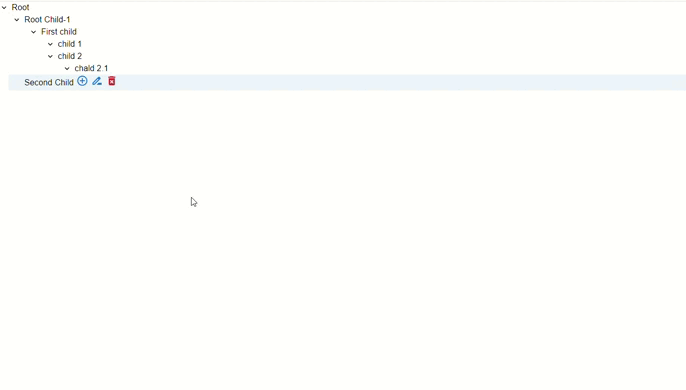
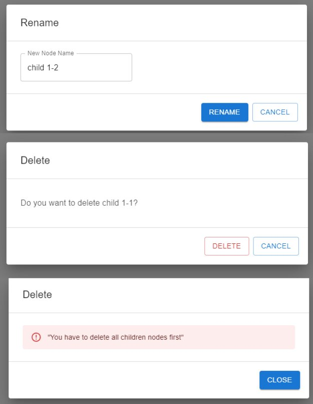
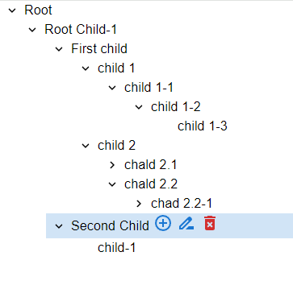

# Это мини-приложение представляет собой деревовидную структуру данных, где каждый узел представляет собой объект с именем и идентификатором. Узлы могут иметь потомков, образуя иерархическую структуру.

## :link: You can try it [here](https://tree-node-app.vercel.app)

## Функциональность:

**Создание дерева:** 
- Приложение инициализируется с корневым узлом "Root".
**Добавление узлов:**
- Пользователь может добавлять новые узлы к дереву, задавая родительский узел и имя нового узла.
**Удаление узлов:**
- Пользователь может удалять узлы из дерева. При удалении узла с потомками, сначала удаляются все его потомки, а затем сам узел.

**Переименование узлов:**
- Пользователь может переименовывать узлы, задавая новый идентификатор и имя.
**Визуализация дерева:**
- Дерево отображается в виде иерархической структуры с помощью компонента TreeView из библиотеки Material UI.
**Панель управления:**
- При выборе узла появляется панель управления, которая позволяет переименовывать узел, удалять его или добавлять к нему нового потомка.

## Использование:

**Приложение может использоваться для представления различных иерархических данных, таких как:**

**Организационная структура:**
- Представление сотрудников в компании с их подчиненными.
**Файловая система:**
- Представление файлов и папок в файловой системе.
**Данные о проектах:**
- Представление задач и подзадач в проекте.

## Заключение:

**Данное мини-приложение предоставляет удобный инструмент для работы с иерархическими данными. 
Оно позволяет создавать, редактировать и удалять узлы в дереве, а также визуализировать его структуру.**
